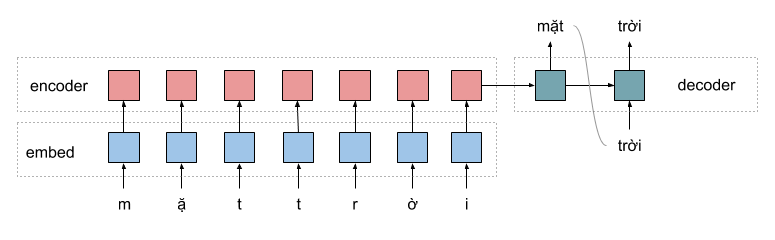

# LSTM
## Giới thiệu
LSTM là một loại mô hình thuộc kiến trúc RNN, mô hình này có thể học được những mối quan hệ lâu dài, được giới thiệu bởi  Hochreiter & Schmidhuber và sau này thì sử dụng rỗng rãi trong những bài toán khác nhau về ngôn ngữ.
## Mô tả bài toán
Để kiểm tra khả năng tách các từ dính liền với nhau của mạng LSTM, mình sử dụng bộ dữ liệu thu thập từ các trang báo mạng như Vnexpess, Vietnamnet, ... Sau đó, xóa tất cả các khoảng trắng, để nối các từ lại. Dữ liệu này dùng để mô hình học. Dữ liệu dùng để mình họa quá trình học cũng như các đặc trưng học được của LSTM. 
## Tiền xử lý
Dữ liệu thu thập được trên các báo mạng gần như chuẩn, do đó, mình chỉ remove các dấu câu. Toàn bộ câu chữ được giữ nguyên.
Dữ liệu huấn luyện được thể hiện dưới bảng sau:

Input | Output
--- | --- 
riêngởxứlạnhkhôngbaogiờcóve | riêng ở xứ lạnh không bao giờ có ve
trẻemtheongườilớnvuiđóntết | trẻ em theo người lớn vui đón tết
bệnhnhânphảinằmđiềutrịcáchly | bệnh nhân phải nằm điều trị cách ly

## Mô hình
Mình sử dụng mô hình sequence2sequence truyền thống để giải quyết bài toán đã ra. Mô hình bao gồm một mạng LSTM encoder và LSTM decoder. Kết quả output của decoder được qua tầng Fully connected, sau đó qua softmax để tìm xác suất từ dự đoán.

## Dependences
- Keras
- Tensorflow
- Anaconda 3.6
## Train
## Kết quả
## References
[Hochreiter, S., & Schmidhuber, J. (1997). Long short-term memory. Neural computation, 9(8), 1735-1780.](http://deeplearning.cs.cmu.edu/pdfs/Hochreiter97_lstm.pdf)

